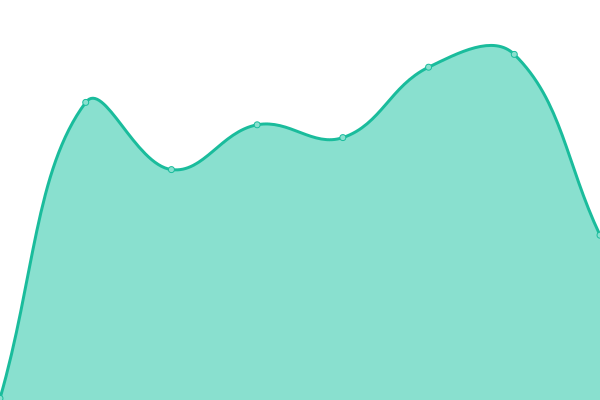

# [📈 Live Status](https://gh.nerdworks.dev): <!--live status--> **🟧 Partial outage**

This repository contains the open-source uptime monitor and status page for [Rajasekharan Vengalil](https://blogorama.nerdworks.in/), powered by [Upptime](https://github.com/upptime/upptime).

With [Upptime](https://upptime.js.org), you can get your own unlimited and free uptime monitor and status page, powered entirely by a GitHub repository. We use [Issues](https://github.com/avranju/upptime/issues) as incident reports, [Actions](https://github.com/avranju/upptime/actions) as uptime monitors, and [Pages](https://gh.nerdworks.dev) for the status page.

<!--start: status pages-->
<!-- This summary is generated by Upptime (https://github.com/upptime/upptime) -->
<!-- Do not edit this manually, your changes will be overwritten -->
<!-- prettier-ignore -->
| URL | Status | History | Response Time | Uptime |
| --- | ------ | ------- | ------------- | ------ |
|  [Nerdworks Blog](https://blogorama.nerdworks.in) | 🟩 Up | [nerdworks-blog.yml](https://github.com/avranju/upptime/commits/HEAD/history/nerdworks-blog.yml) | 

 1145ms
     
 | 

<a href="https://gh.nerdworks.dev/history/nerdworks-blog">100.00%</a>
    

|  [Back To The Garden](https://backtothegarden.in) | 🟩 Up | [back-to-the-garden.yml](https://github.com/avranju/upptime/commits/HEAD/history/back-to-the-garden.yml) | 

 1019ms
     
 | 

<a href="https://gh.nerdworks.dev/history/back-to-the-garden">100.00%</a>
    

|  [Nerdworks AI](https://ai.nerdworks.dev) | 🟩 Up | [nerdworks-ai.yml](https://github.com/avranju/upptime/commits/HEAD/history/nerdworks-ai.yml) | 

 920ms
     
 | 

<a href="https://gh.nerdworks.dev/history/nerdworks-ai">100.00%</a>
    

|  [Nerdworks LiteLLM](https://litellm.nerdworks.dev) | 🟩 Up | [nerdworks-lite-llm.yml](https://github.com/avranju/upptime/commits/HEAD/history/nerdworks-lite-llm.yml) | 

 899ms
     
 | 

<a href="https://gh.nerdworks.dev/history/nerdworks-lite-llm">100.00%</a>
    

|  [Nerdworks N8N](https://n8n.nerdworks.dev) | 🟥 Down | [nerdworks-n8-n.yml](https://github.com/avranju/upptime/commits/HEAD/history/nerdworks-n8-n.yml) | 

 905ms
     
 | 

<a href="https://gh.nerdworks.dev/history/nerdworks-n8-n">99.99%</a>
    

|  [Nerdworks Convex API Prod](https://convex.api.nerdworks.dev) | 🟩 Up | [nerdworks-convex-api-prod.yml](https://github.com/avranju/upptime/commits/HEAD/history/nerdworks-convex-api-prod.yml) | 

 749ms
     
 | 

<a href="https://gh.nerdworks.dev/history/nerdworks-convex-api-prod">100.00%</a>
    

|  [Nerdworks Convex Dashboard Prod](https://convex.dashboard.nerdworks.dev) | 🟩 Up | [nerdworks-convex-dashboard-prod.yml](https://github.com/avranju/upptime/commits/HEAD/history/nerdworks-convex-dashboard-prod.yml) | 

 737ms
     
 | 

<a href="https://gh.nerdworks.dev/history/nerdworks-convex-dashboard-prod">100.00%</a>
    

|  [Nerdworks Convex API Dev](https://dev.convex.api.nerdworks.dev) | 🟩 Up | [nerdworks-convex-api-dev.yml](https://github.com/avranju/upptime/commits/HEAD/history/nerdworks-convex-api-dev.yml) | 

 719ms
     
 | 

<a href="https://gh.nerdworks.dev/history/nerdworks-convex-api-dev">100.00%</a>
    

|  [Nerdworks Convex Dashboard Dev](https://dev.convex.dashboard.nerdworks.dev) | 🟩 Up | [nerdworks-convex-dashboard-dev.yml](https://github.com/avranju/upptime/commits/HEAD/history/nerdworks-convex-dashboard-dev.yml) | 

 732ms
     
 | 

<a href="https://gh.nerdworks.dev/history/nerdworks-convex-dashboard-dev">100.00%</a>
    

|  [Court Capo](https://courtcapo.nerdworks.dev) | 🟩 Up | [court-capo.yml](https://github.com/avranju/upptime/commits/HEAD/history/court-capo.yml) | 

 1022ms
     
 | 

<a href="https://gh.nerdworks.dev/history/court-capo">100.00%</a>
    

|  [Nerdworks Search](https://search.nerdworks.dev) | 🟩 Up | [nerdworks-search.yml](https://github.com/avranju/upptime/commits/HEAD/history/nerdworks-search.yml) | 

 1115ms
     
 | 

<a href="https://gh.nerdworks.dev/history/nerdworks-search">100.00%</a>
    

|  [Nerdworks Gists](https://gist.nerdworks.dev/) | 🟩 Up | [nerdworks-gists.yml](https://github.com/avranju/upptime/commits/HEAD/history/nerdworks-gists.yml) | 

 2202ms
     
 | 

<a href="https://gh.nerdworks.dev/history/nerdworks-gists">100.00%</a>
    

|  [Nerdworks Gitea](https://git.nerdworks.dev/) | 🟩 Up | [nerdworks-gitea.yml](https://github.com/avranju/upptime/commits/HEAD/history/nerdworks-gitea.yml) | 

 1374ms
     
 | 

<a href="https://gh.nerdworks.dev/history/nerdworks-gitea">100.00%</a>
    

|  [Nerdworks pgadmin4](https://pgadmin4.nerdworks.dev) | 🟩 Up | [nerdworks-pgadmin4.yml](https://github.com/avranju/upptime/commits/HEAD/history/nerdworks-pgadmin4.yml) | 

 945ms
     
 | 

<a href="https://gh.nerdworks.dev/history/nerdworks-pgadmin4">100.00%</a>
    

|  [Nerdworks Writebook](https://writebook.nerdworks.dev) | 🟩 Up | [nerdworks-writebook.yml](https://github.com/avranju/upptime/commits/HEAD/history/nerdworks-writebook.yml) | 

 1119ms
     
 | 

<a href="https://gh.nerdworks.dev/history/nerdworks-writebook">100.00%</a>
    

|  [Musings Blog](https://musings.nerdworks.dev/) | 🟩 Up | [musings-blog.yml](https://github.com/avranju/upptime/commits/HEAD/history/musings-blog.yml) | 

 183ms
     
 | 

<a href="https://gh.nerdworks.dev/history/musings-blog">100.00%</a>
    

|  [Remark42 Comments on Musings Blog](https://remark42.nerdworks.dev/api/v1/config?site=remark) | 🟩 Up | [remark42-comments-on-musings-blog.yml](https://github.com/avranju/upptime/commits/HEAD/history/remark42-comments-on-musings-blog.yml) | 

 848ms
     
 | 

<a href="https://gh.nerdworks.dev/history/remark42-comments-on-musings-blog">100.00%</a>
    

|  [ToteUp AD Auth](https://toteupad.nerdworks.dev/device.html) | 🟩 Up | [tote-up-ad-auth.yml](https://github.com/avranju/upptime/commits/HEAD/history/tote-up-ad-auth.yml) | 

 842ms
     
 | 

<a href="https://gh.nerdworks.dev/history/tote-up-ad-auth">100.00%</a>
    

<!--end: status pages-->

[**Visit our status website →**](https://gh.nerdworks.dev)

## 📄 License

- Powered by: [Upptime](https://github.com/upptime/upptime)
- Code: [MIT](./LICENSE) © [Rajasekharan Vengalil](https://blogorama.nerdworks.in/)
- Data in the `./history` directory: [Open Database License](https://opendatacommons.org/licenses/odbl/1-0/)
